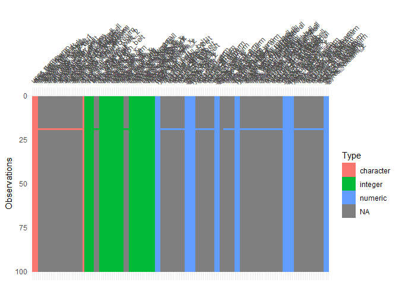
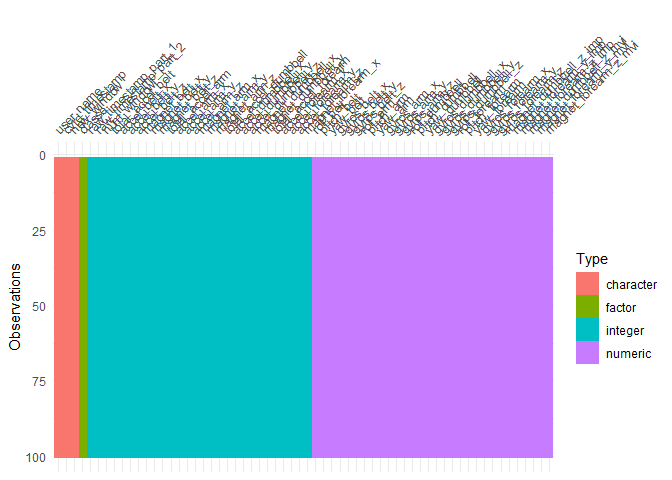

Predicting the Quality of Execution of Weightlifting Exercises
================
Jan

Executive Summary
=================

-   I analyzed a data set containing the weightlifting movements of six candidates who were tracked with four different gyrosensors.
-   After a first exploratory analysis, I performed a data imputation to fill up missing values in the feature data
-   Two powerful classification models were chosen, namely extreme gradient boosting and a random forest
-   Both models performed extremely well on the training data set with 99.9% (random forest) and 99.2% (xgb) out-of-sample performance measured by a five-fold cross-validation approach

Exploratory analyses
====================

After loading the provided data set, I performed a first exploratory analysis. There exist five different classes according to which the movements were performed: A (exactly according to the specification), B (throwing the ellbows to the front), C (lifting the dumbbell only halfway), D (lowering the dumbbell only halfway) and E (throwing the hips to the front). As can be seen, classes are distributed almost equally over the training set.

    ## 
    ##    A    B    C    D    E 
    ## 5580 3797 3422 3216 3607

Moreover, I noted a considerable amount of missing values as shown in the graph below. 

Data Preprocessing
==================

Considering the amount of missingness in the feature data, I first performed a data cleaning step. I excluded feature columns with less than 50% fill rate. Moreover, for the rest of the columns with missing values, I imputed the latter by the mean and added an indicator column. The following graph shows the distribution of different data types in my training sample.

``` r
# need factors for classification problem
training <- training %>% 
  mutate(classe = factor(classe, 
                         levels = c("A", "B", "C", "D", "E"))) 

# exclude cols w. < 50% fill rate
exclude.cols <- which(fill.col < 1)
na.cols <- which(fill.col >= .5 & fill.col < 1)
training_preproc <- training %>% select(-exclude.cols)

# impute missing values and create missing value indicators (mvi)
training_imputed <- training %>% select(c(1, na.cols)) %>% 
  mutate(magnet_dumbbell_z_imp = ifelse(is.na(magnet_dumbbell_z), 
                                        mean(magnet_dumbbell_z, na.rm = T), 
                                        magnet_dumbbell_z),
         magnet_forearm_y_imp = ifelse(is.na(magnet_forearm_y), 
                                       mean(magnet_forearm_y, na.rm = T), 
                                       magnet_forearm_y),
         magnet_forearm_z_imp = ifelse(is.na(magnet_forearm_z), 
                                       mean(magnet_forearm_z, na.rm = T), 
                                       magnet_forearm_z),
         magnet_dumbbell_z_mvi = ifelse(is.na(magnet_dumbbell_z), 1, 0),
         magnet_forearm_y_mvi = ifelse(is.na(magnet_forearm_y),  1, 0),
         magnet_forearm_z_mvi = ifelse(is.na(magnet_forearm_z),  1, 0)) %>%
  select(-c(magnet_dumbbell_z, magnet_forearm_y, magnet_forearm_z))

# create training data set
training_preproc <- merge(training_preproc, training_imputed, by = "X1") %>% select(-"X1")
training_preproc[sample(1:nrow(training_preproc), 100),] %>% vis_dat(sort_type = T)
```



Predictive modeling
===================

In the following step, I chose to first train a gradient boosting model to predict the specific class of movement execution based on the available feature data. I used the caret package and selected a five-fold cross-validation approach to choose the best model configuration based on accuracy.

``` r
# create the caret experiment using the trainControl() function
ctrl <- trainControl(
  method = "cv", number = 5, # 5-fold CV
  selectionFunction = "best", # select the best performer
  savePredictions = TRUE
)

# xgb
if(file.exists("../models/model_xgb.rds")){
  model.xgb <- readRDS("../models/model_xgb.rds")
} else {
  xgb.grid <- expand.grid(nrounds = c(50, 100, 150), 
                          max_depth = c(6, 7, 8), eta = 0.3, 
                          subsample = 1, colsample_bytree = 1, 
                          gamma = 0, min_child_weight = 1)
  
  model.xgb <- train(classe ~ ., 
                     method = "xgbTree", 
                     data = training_preproc,
                     trControl = ctrl,
                     tuneGrid = xgb.grid)
  model.xgb
  saveRDS(model.xgb, file = "../models/model_xgb.rds")
}
```

Similarly, I trained a random forest model and also chose the best model configuration based on the accuracy measure over a five-fold cross-validation.

``` r
if(file.exists("../models/model_ranger.rds")){
  model.ranger <- readRDS("../models/model_ranger.rds")
} else {
  ranger.grid <- expand.grid(mtry = 5:20, splitrule = "gini", 
                             min.node.size = c(1, 3, 5))
  model.ranger <- train(classe ~ .,
                        method = "ranger",
                        data = training_preproc,
                        trControl = ctrl, 
                        tuneGrid = ranger.grid)
  model.ranger
  saveRDS(model.ranger, file = "../models/model_ranger.rds")
}
```

Evaluation
==========

In the following, I compare the out-of-sample results of the two model classes calculated from the cross-validation of the training data set. As can be seen, both models perform extremely well. Due to its slightly better performance, I chose the random forest model as the final model and used it to predict the instances of the test sample.

``` r
model.xgb
```

    ## eXtreme Gradient Boosting 
    ## 
    ## 19622 samples
    ##    61 predictor
    ##     5 classes: 'A', 'B', 'C', 'D', 'E' 
    ## 
    ## No pre-processing
    ## Resampling: Cross-Validated (5 fold) 
    ## Summary of sample sizes: 15697, 15697, 15698, 15697, 15699 
    ## Resampling results across tuning parameters:
    ## 
    ##   max_depth  nrounds  Accuracy   Kappa    
    ##   6           50      0.9883806  0.9853042
    ##   6          100      0.9886353  0.9856268
    ##   6          150      0.9886353  0.9856268
    ##   7           50      0.9909285  0.9885274
    ##   7          100      0.9911324  0.9887851
    ##   7          150      0.9911324  0.9887851
    ##   8           50      0.9922030  0.9901392
    ##   8          100      0.9923049  0.9902679
    ##   8          150      0.9923049  0.9902679
    ## 
    ## Tuning parameter 'eta' was held constant at a value of 0.3
    ##  1
    ## Tuning parameter 'min_child_weight' was held constant at a value of
    ##  1
    ## Tuning parameter 'subsample' was held constant at a value of 1
    ## Accuracy was used to select the optimal model using the largest value.
    ## The final values used for the model were nrounds = 100, max_depth = 8,
    ##  eta = 0.3, gamma = 0, colsample_bytree = 1, min_child_weight = 1
    ##  and subsample = 1.

``` r
model.ranger
```

    ## Random Forest 
    ## 
    ## 19622 samples
    ##    61 predictor
    ##     5 classes: 'A', 'B', 'C', 'D', 'E' 
    ## 
    ## No pre-processing
    ## Resampling: Cross-Validated (5 fold) 
    ## Summary of sample sizes: 15696, 15697, 15698, 15699, 15698 
    ## Resampling results across tuning parameters:
    ## 
    ##   mtry  min.node.size  Accuracy   Kappa    
    ##    5    1              0.9986750  0.9983240
    ##    5    3              0.9987769  0.9984529
    ##    5    5              0.9985731  0.9981952
    ##    6    1              0.9989298  0.9986463
    ##    6    3              0.9987769  0.9984530
    ##    6    5              0.9988788  0.9985819
    ##    7    1              0.9988788  0.9985818
    ##    7    3              0.9988788  0.9985819
    ##    7    5              0.9989298  0.9986463
    ##    8    1              0.9990317  0.9987752
    ##    8    3              0.9988788  0.9985819
    ##    8    5              0.9988788  0.9985818
    ##    9    1              0.9991336  0.9989041
    ##    9    3              0.9990317  0.9987752
    ##    9    5              0.9988788  0.9985818
    ##   10    1              0.9990826  0.9988397
    ##   10    3              0.9990317  0.9987752
    ##   10    5              0.9990317  0.9987752
    ##   11    1              0.9990827  0.9988397
    ##   11    3              0.9990317  0.9987752
    ##   11    5              0.9989807  0.9987108
    ##   12    1              0.9991336  0.9989041
    ##   12    3              0.9989807  0.9987108
    ##   12    5              0.9990317  0.9987752
    ##   13    1              0.9990317  0.9987752
    ##   13    3              0.9990826  0.9988397
    ##   13    5              0.9990317  0.9987752
    ##   14    1              0.9990826  0.9988397
    ##   14    3              0.9991336  0.9989041
    ##   14    5              0.9990317  0.9987752
    ##   15    1              0.9991336  0.9989041
    ##   15    3              0.9990826  0.9988397
    ##   15    5              0.9991336  0.9989041
    ##   16    1              0.9991845  0.9989685
    ##   16    3              0.9991336  0.9989041
    ##   16    5              0.9991336  0.9989041
    ##   17    1              0.9991845  0.9989686
    ##   17    3              0.9992865  0.9990975
    ##   17    5              0.9990826  0.9988396
    ##   18    1              0.9992865  0.9990975
    ##   18    3              0.9991845  0.9989686
    ##   18    5              0.9992355  0.9990330
    ##   19    1              0.9991845  0.9989686
    ##   19    3              0.9991846  0.9989686
    ##   19    5              0.9991336  0.9989041
    ##   20    1              0.9993374  0.9991620
    ##   20    3              0.9992865  0.9990975
    ##   20    5              0.9992356  0.9990331
    ## 
    ## Tuning parameter 'splitrule' was held constant at a value of gini
    ## Accuracy was used to select the optimal model using the largest value.
    ## The final values used for the model were mtry = 20, splitrule = gini
    ##  and min.node.size = 1.

Prediction of new instances
===========================

In order to predict the instances of the test sample, I first preprocessed the test sample in the same way as the training sample. Of particular importance was that I only used information from the training sample when imputing the missing values in the test data set. For this reason, I filled the missing values with the mean values from the training sample of the respective columns.

``` r
testing_preproc <- testing %>% select(-exclude.cols)
# impute missing values and create missing value indicators (mvi)
testing_imputed <- testing %>% select(c(1, na.cols)) %>% 
  mutate(magnet_dumbbell_z_imp = ifelse(is.na(magnet_dumbbell_z), 
                                        mean(training$magnet_dumbbell_z, na.rm = T), 
                                        magnet_dumbbell_z),
         magnet_forearm_y_imp = ifelse(is.na(magnet_forearm_y), 
                                       mean(training$magnet_forearm_y, na.rm = T), 
                                       magnet_forearm_y),
         magnet_forearm_z_imp = ifelse(is.na(magnet_forearm_z), 
                                       mean(training$magnet_forearm_z, na.rm = T), 
                                       magnet_forearm_z),
         magnet_dumbbell_z_mvi = ifelse(is.na(magnet_dumbbell_z), 1, 0),
         magnet_forearm_y_mvi = ifelse(is.na(magnet_forearm_y),  1, 0),
         magnet_forearm_z_mvi = ifelse(is.na(magnet_forearm_z),  1, 0)) %>%
  select(-c(magnet_dumbbell_z, magnet_forearm_y, magnet_forearm_z))

testing_preproc <- merge(testing_preproc, testing_imputed, by = "X1") %>% select(-"X1")
predictions <- predict(model.ranger, newdata = testing_preproc)
```

Conclusion
==========

The outcome of the machine learning project suggests that the quality of weightlifting movements can be predicted based on gyrosensor measurements with a very high accuracy. Out of two very well performing classification models, the random forest was slightly superior and achieved a 99.9% out-of-sample accuracy measured with five-fold cross-validation.
